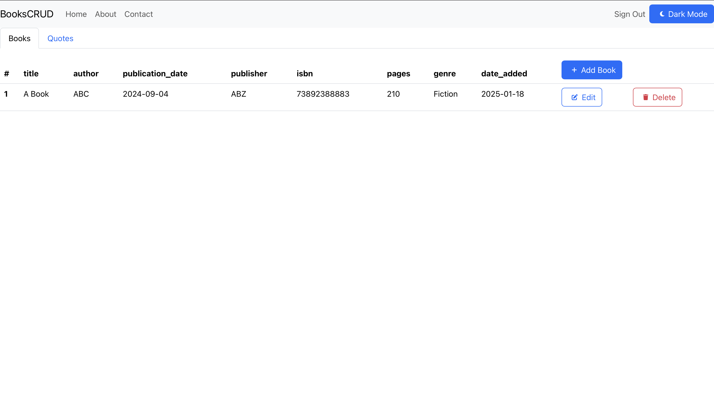

<a id="readme-top"></a>

<!-- ABOUT THE PROJECT -->
## About BooksCRUD project

[](Docsfiles/Books_page.png)

The BooksCRUD is a full-stack web application built with React.js and C#, allowing users to manage a collection of books efficiently. The system provides a user-friendly interface for performing CRUD operations (Create, Read, Update, Delete) on books.

The frontend is developed using React.js for an interactive user experience.
The backend is powered by C#.NET to handle API requests and data management.

### Key Features:
- ✅ View a list of books with detailed information.
- ✅ Add new books to the list of books.
- ✅ Edit and update book details.
- ✅ Delete books from list of books.
- ✅ View a list of quotes with detailed information.
- ✅ Add new quote to the list of quotes.
- ✅ Edit and update quote details.


This system is ideal for managing personal libraries, tracking books, or serving as a foundation for larger inventory management applications. BooksCRUD is designed with security in mind, ensuring data protection through user authentication. The backend is secured using JWT authentication, preventing unauthorized access.

<p align="right">(<a href="#readme-top">back to top</a>)</p>

<!-- TABLE OF CONTENTS -->
<details>
  <summary>Table of Contents</summary>
  <ol>
    <li>
      <a href="#about-the-project">About The Project</a>
      <ul>
        <li><a href="#built-with">Built With</a></li>
      </ul>
    </li>
    <li>
      <a href="#getting-started">Getting Started</a>
      <ul>
        <li><a href="#prerequisites">Prerequisites</a></li>
        <li><a href="#installation">Installation</a></li>
      </ul>
    </li>
    <li><a href="#usage">Usage</a></li>
    <li><a href="#roadmap">Roadmap</a></li>
    <li><a href="#contributing">Contributing</a></li>
    <li><a href="#license">License</a></li>
    <li><a href="#contact">Contact</a></li>
    <li><a href="#acknowledgments">Acknowledgments</a></li>
  </ol>
</details>

## Built With

This project was built with:

### Frontend
- React.js – UI development library.
- React Router – Enables navigation within the app.
- Bootstrap – CSS Framework for developing responsive websites.
### Backend
- ASP.NET 8 – Framework for building scalable REST APIs.
- Entity Framework Core – ORM for database operations.
- JWT Authentication – Secure user authentication.

<p align="right">(<a href="#readme-top">back to top</a>)</p>


## Prerequisites

Before starting the application, ensure you have the following installed:

* .NET 8 SDK – Download [https://dotnet.microsoft.com/en-us/download/dotnet/8.0](https://dotnet.microsoft.com/en-us/download/dotnet/8.0)
* Node.js – Download [https://nodejs.org/en](https://nodejs.org/en)
* npm (Node Package Manager) – Included with Node.js installation.

## Installation
Install project dependencies on your local machine. These commands install the necessary packages and their dependencies. Run the application using Docker or without Docker.

### Frontend
1. Go to project directory
    ```sh
   cd Frontend/bookscrud
   ```
2. Install dependencies
   ```sh
   npm install
   ```
Run frontend using docker:

3. Build and run frontend
   ```sh
   docker build -t bookscrud-frontend .
   docker run -p 3000:3000 bookscrud-frontend
   ```
### Backend 
1. Go to project directory
    ```sh
   cd Backend/api
   ```
2. Install dependencies
   ```sh
   dotnet restore
   ```
Run backend using docker:

3. Build and run backend 
   ```sh
   docker build -t bookscrud-backend .
   docker run -p 5252:5252 bookscrud-backend
   ```

<p align="right">(<a href="#readme-top">back to top</a>)</p>

## API Endpoints
| Method | Endpoint | Description |
|--------|-----------|-------------|
| GET    | /api/books | Retrieve a list of all books |
| GET    | /api/books/{id} | Retrieve a specific book by ID |
| POST   | /api/books | Add a new book |
| PUT    | /api/books/{id} | Update an existing book by ID |
| DELETE | /api/books/{id} | Delete a book by ID |
| GET    | /api/quotes | Retrieve a list of all quotes |
| GET    | /api/quotes/{id} | Retrieve a specific quote by ID |
| POST   | /api/quotes | Add a new quote |
| PUT    | /api/quotes/{id} | Update an existing quote by ID |
| DELETE | /api/quotes/{id} | Delete a quote by ID |

<!-- LICENSE -->
## License

Distributed under the Apache License 2.0. See `LICENSE.txt` for more information.

<p align="right">(<a href="#readme-top">back to top</a>)</p>