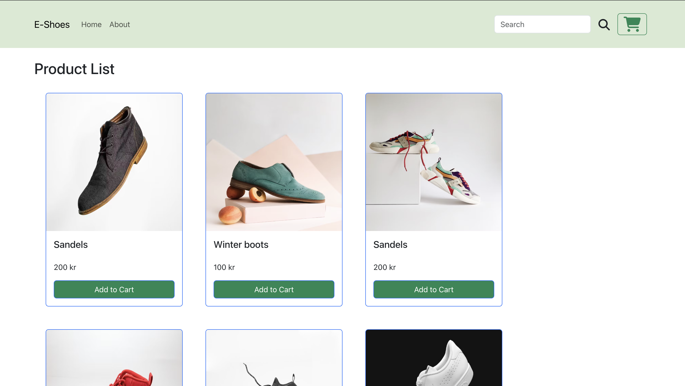

<a id="readme-top"></a>

<!-- ABOUT THE PROJECT -->
## About e-Shoes

[](public/products_page.png)

The e-Shoes is an application built with React and Redux. This application showcases a simple shopping cart system by allowing users to add products to a cart. The cart system enables users to easily manage products.

The frontend is developed using React for an interactive user experience.
The cart system is implemented with Redux to easily store products.

### Key Features:
- ✅ Display list of products with detailed information.
- ✅ Display products in the cart
- ✅ Add a product to cart.
- ✅ Manage quantity of a product
- ✅ Remove product from cart


<p align="right">(<a href="#readme-top">back to top</a>)</p>

<!-- TABLE OF CONTENTS -->
<details>
  <summary>Table of Contents</summary>
  <ol>
    <li>
      <a href="#about-the-project">About The Project</a>
      <ul>
        <li><a href="#built-with">Built With</a></li>
      </ul>
    </li>
    <li>
      <a href="#getting-started">Getting Started</a>
      <ul>
        <li><a href="#prerequisites">Prerequisites</a></li>
        <li><a href="#installation">Installation</a></li>
      </ul>
    </li>
    <li><a href="#license">License</a></li>

  </ol>
</details>

## Built With

This project was built with:

### Frontend
- React – UI development library.
- Redux – Enables global state management.
- Bootstrap – CSS Framework for developing responsive websites.
- Fontawesome - Toolkit based on CSS and Less that contains scalable icons.

<p align="right">(<a href="#readme-top">back to top</a>)</p>


## Prerequisites

Before starting the application, ensure you have the following installed:

* Node.js – Download [https://nodejs.org/en](https://nodejs.org/en)
* npm (Node Package Manager) – Included with Node.js installation.

## Installation
Install project dependencies on your local machine. These commands install the necessary packages and their dependencies. Run the application using Docker or without Docker.

### Frontend
1. Go to project directory
    ```sh
   cd e-shoes
   ```
2. Install dependencies
   ```sh
   npm install
   ```
3. Run products using npm
   ```sh
   npm run dev
   ```
Run project using docker:

1. Go to project directory
    ```sh
   cd e-shoes
   ```

2. Build and run frontend
   ```sh
   docker build -t e-shoes .
   docker run -p 3000:3000 e-shoes
   ```

<p align="right">(<a href="#readme-top">back to top</a>)</p>

<!-- LICENSE -->
## License

Distributed under the Apache License 2.0. See `LICENSE.txt` for more information.

<p align="right">(<a href="#readme-top">back to top</a>)</p>