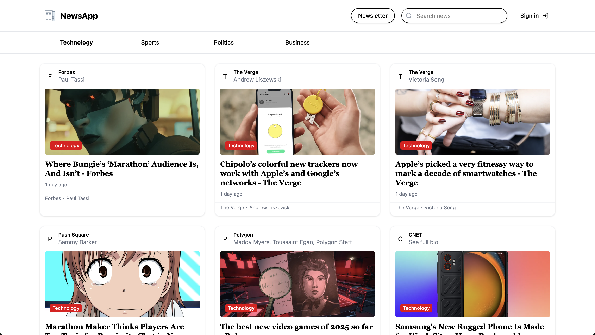

<a id="readme-top"></a>

<!-- ABOUT THE PROJECT -->
## About News Aggregator

[](public/page_news.png)

News Aggregator is a dynamic and user-friendly news app designed to provide users with real-time news updates from various sources, all categorized for easy browsing. The platform ensures that users stay informed about the latest events across multiple domains, including politics, technology, business, sports, entertainment, and more.  

React was used in the development of the news app to create an interactive user interface. The backend was written using Firebase, which makes it simple to write and read data, authorize clients, and process that data.

### Key Features:
- ✅ News articles are grouped into different categories.
- ✅ Users can explore trending stories within each category.
- ✅ Displays articles in a standardized card-style layout.
- ✅ Users can search for news articles by keywords.
- ✅ Users can sign up and create accounts.
- ✅ Option to bookmark articles.
- ✅ Users can subscribe to daily newsletter via email.
- ✅ Dark mode support for improved readability.


<p align="right">(<a href="#readme-top">back to top</a>)</p>

<!-- TABLE OF CONTENTS -->
<details>
  <summary>Table of Contents</summary>
  <ol>
    <li>
      <a href="#about-the-project">About The Project</a>
      <ul>
        <li><a href="#built-with">Built With</a></li>
      </ul>
    </li>
    <li>
      <a href="#getting-started">Getting Started</a>
      <ul>
        <li><a href="#prerequisites">Prerequisites</a></li>
        <li><a href="#installation">Installation</a></li>
      </ul>
    </li>
    <li><a href="#license">License</a></li>

  </ol>
</details>

## Built With

This project was built with:

### Frontend
- React – UI development library.
- Zustand – Enables global state management.
- Firebase - Provides backend services such as a realtime database, cloud storage, authentication.
- React Query - Simplifies fetching data and managing states in React applications.
- Tailwindcss – CSS Framework for developing responsive websites.
- Shadcn - An adaptable component library for using Tailwind CSS and React.
- Lucide React - A icon library that contains scalable icons.

<p align="right">(<a href="#readme-top">back to top</a>)</p>


## Prerequisites

Before starting the application, ensure you have the following installed:

* Node.js – Download [https://nodejs.org/en](https://nodejs.org/en)
* npm (Node Package Manager) – Included with Node.js installation.

## Installation
Install project dependencies on your local machine. These commands install the necessary packages and their dependencies. Run the application using Docker or without Docker.

### Frontend
1. Go to project directory
    ```sh
   cd news-aggregator
   ```
2. Install dependencies
   ```sh
   npm install
   ```
3. Run products using npm
   ```sh
   npm run dev
   ```
Run project using docker:

1. Go to project directory
    ```sh
   cd news-aggregator
   ```

2. Build and run frontend
   ```sh
   docker build -t news-aggregator .
   docker run -p 3000:3000 news-aggregator
   ```

<p align="right">(<a href="#readme-top">back to top</a>)</p>

<!-- LICENSE -->
## License

Distributed under the Apache License 2.0. See `LICENSE.txt` for more information.

<p align="right">(<a href="#readme-top">back to top</a>)</p>